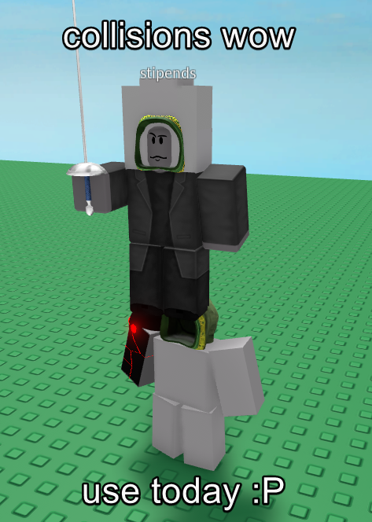

### 
this works on EVERY executor. make sure not to rejoin servers or it will break the script.

# 
PresidentAnvil's Hatdrop Reanimation

feel free to use these in your hubs, but please credit me! this github will contain all the premade FE Scripts i've made with hatdrop. if you've got any questions, hmu on discord (president_anvil)

## 
Known Issues

- Shoulder Accesories tend to not drop. This might be because of the orientation the character is in on death. I'll look into it soon.

## 
AKNOWLEDGE THAT...

you will have to make everything else on you own, such as:
- default accessories system, like myworld's

# 
Credits

- Plusgiant5 for helping.

- ShownApe for his <a href="https://github.com/ShownApe/hatdrop">hatdrop</a> script having a couple good concepts that I used. also digitality's <a href="https://github.com/PresidentAnvil/hatdrop">hatdrop</a> for the same reason

